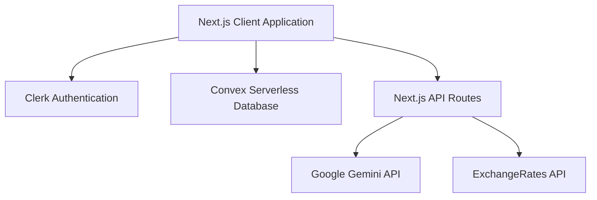
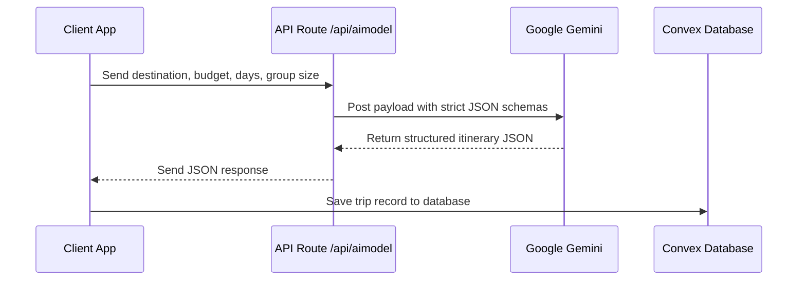

# Software Requirements Specification (SRS)
## For SkyTrip — AI Powered Trip Planner

---

## 1. Introduction

### 1.1 Purpose
This document specifies the software requirements and system architecture for **SkyTrip**, an AI-powered travel planning and companion web application. SkyTrip leverages advanced Generative AI models (Google Gemini) alongside modern serverless and database systems to design, format, modify, and export interactive travel itineraries.

### 1.2 Scope
SkyTrip is a Next.js-based SaaS platform designed to automate travel planning. Users can query the AI system to generate complete day-by-day travel itineraries containing curated hotels, locations, activity coordinates, packing guidelines, flight search shortcuts, currency converters, and local timezone indicators. The platform enforces security through user authentication and manages credits via a Convex serverless database backend.

---

## 2. Technology Stack & Core Architecture

The system is built as a modern, full-stack Next.js web application utilizing serverless database technology and edge API routing:



### 2.1 Frontend
- **Framework**: Next.js 14 (App Router)
- **Styling**: Tailwind CSS & CSS Modules
- **Animations**: Framer Motion (`motion/react`) for page transitions and tab switcher effects
- **Icons**: Lucide React
- **Toast Notifications**: Sonner

### 2.2 Backend & Database
- **Database Layer**: Convex Serverless Database (Reactive, live syncing query subscriptions)
- **Authentication**: Clerk (Integrated JWT credentials for secure Convex queries)
- **API Adapters**: Axios (REST interface layer)

### 2.3 External APIs
- **Core AI Model**: Google Gemini API (`gemini-1.5-flash` / `gemini-2.5-flash` via Generative Language REST endpoints)
- **Exchange Rates**: Open Exchange Rates / ExchangeRate-API (via fallback cached values)

---

## 3. Database Schema (Convex)

Convex defines reactive schemas utilizing TypeScript models. The core schema defines users, trips, exchange rates, and timezone configurations:

### 3.1 Schema Definition (`convex/schema.ts`)
- **`users` Table**:
  - `name`: `v.string()` (User display name)
  - `email`: `v.string()` (Clerk primary email address)
  - `picture`: `v.string()` (Avatar image URL)
  - `credits`: `v.number()` (Available AI credits)
  - `tokenIdentifier`: `v.string()` (Clerk authentication JWT identifier)
- **`trips` Table**:
  - `userId`: `v.string()` (Reference link to user identifier)
  - `userEmail`: `v.string()` (Link user email)
  - `tripData`: `v.any()` (Complete JSON output representing hotels and itinerary generated by AI)
  - `tripContext`: `v.any()` (User selections like origin, destination, days, budget, and group size)
  - `companionData`: `v.optional(v.any())` (Cached timezone difference, currency rates, tips, and event calendars)

---

## 4. System Features & Workflows

### 4.1 AI-Driven Trip Itinerary Generation
Users input trip options: Origin, Destination, Number of Days, Budget Level (Budget, Medium, Luxury), and Travel Companion Group Size.
1. The client sends a request to `/api/aimodel`.
2. The route constructs a structured prompt using JSON response schemas.
3. The Gemini model generates a detailed response detailing:
   - Recommended hotels (name, address, cost, ratings, image, coordinates).
   - Daily itineraries (places, details, timings, ticket pricing, coordinates).
4. The generated data is stored in the Convex `trips` table.



### 4.2 Trip Companion & Global Toolkit
The **Trip Companion Addon** (`TripPlannerAddon.tsx`) parses the generated trip parameters and delivers localized utilities:
- **Currency Converter**: Syncs real-time exchange rates. Includes offline failsafes with static exchange buffers.
- **Timezone Comparative Slider**: Displays the current offset between origin and destination, providing interactive warning colors if a selected hour is outside sociable contact times.
- **Local Festivals & Events Calendar**: Provides an interactive lists layout showing seasonal public holidays and cultural festivals.
- **Dynamic AI Travel Tips**: Generates instructions regarding card-vs-cash preference, mobile connectivity (eSIM recommendations), and local protocols.

### 4.3 Conversational Trip Assistant Chatbot
The interactive chat panel (`TripChatbot.tsx`) allows users to query questions specific to their itinerary:
- **API Route**: `/api/chat/route.ts`
- **Fallback Protocol**: If the free tier Gemini API key hits a `429 Rate Limit` (RESOURCE_EXHAUSTED), the system responds with details containing the exact error code/message rather than silent failures, allowing clear developer/user debug cycles.

---

## 5. Security & Credit Controls

### 5.1 Authentication Checks
All write-capable endpoints and Convex database updates require Clerk authorization tokens. Anonymous access is limited to read-only mock states or public demo itineraries.

### 5.2 Credit Management
Users receive 10 initial free credits upon registration:
- **Trip Generation**: Consumes **1 credit**.
- **AI Companion Addon Unlock**: Consumes **1 credit** (Free tier requires manual unlocking, whereas Premium Tier gets instant authorization).
- The Convex backend validates the user's current credit balance using reactive mutations:
  ```typescript
  // Decrements credits securely on the server
  export const decrementAICredits = mutation({
    args: { uid: v.id("users") },
    handler: async (ctx, args) => {
      const user = await ctx.db.get(args.uid);
      if (!user || user.credits <= 0) throw new Error("Insufficient credits");
      await ctx.db.patch(args.uid, { credits: user.credits - 1 });
      return await ctx.db.get(args.uid);
    }
  });
  ```

---

## 6. Development & Deployment Configuration

### 6.1 Environment Variables (`.env.local`)
Create a file named `.env.local` containing the following keys:
```env
# Clerk Authentication Keys
NEXT_PUBLIC_CLERK_PUBLISHABLE_KEY=pk_test_...
CLERK_SECRET_KEY=sk_test_...

# Convex DB Endpoint
NEXT_PUBLIC_CONVEX_URL=https://...convex.cloud

# Google Generative AI API Key
GEMINI_API_KEY=AIzaSy...
```

### 6.2 Key Commands
- Install project dependencies:
  ```bash
  npm install
  ```
- Run the local development Next.js dev server:
  ```bash
  npm run dev
  ```
- Start the Convex database watcher in the background:
  ```bash
  npx convex dev
  ```
- Verify TypeScript types compile cleanly:
  ```bash
  npx tsc --noEmit
  ```
